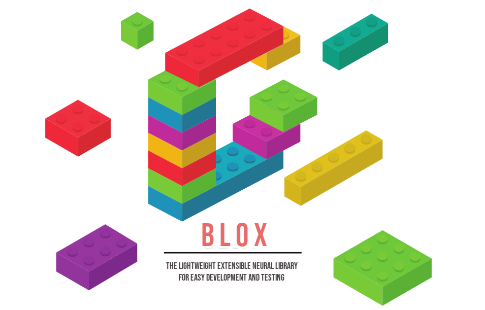

<p align="center">
  
</p>


### Neural Network building blocks. A simple and extensible wrapper around pytorch

BLOX is a JSON structre based configuration library meant to accelerate and automate the development of neural network models using the PyTorch library.
Because of the JSON configuration it allows for ease of integration into web applications.


## Table Of Contents
1. [Basic Usage](#using)
2. [Creating Networks in BLOX](#creating)
3. [Defining BLOX](#defining)
4. [Importing Modules](#importing)
5. [Extending BLOX Modules](#extending)
6. [DataSet Creation](#datasets)
7. [Training With BLOX](#training)
8. [Tensorboard](#tensorboard)


## <a name="using"></a> Basic Usage
The BLOX framework can be applied in many different ways. For example, if you want to only define and compile a neural network, you can dreate a config and pass it to the compiler, like so.

```python
import json
import torch
from BLOX import Compile

'''
    The Compiler can consume either a dictionary 
    or the path to a BLOX file, which is demonstrated below.
'''
json_string = """{
    "LAYERS":[
            {
                "DEF":"MyFirstBlock"
            },
            {
                "Other":[
                    "Conv1d",
                    {
                        "in_channels":128,
                        "out_channels":32,
                        "kernel_size":4
                    }
                ]
            }
    ],
    "Notes":"",
    "Name":"",
    "DEFS":{
            "MyFirstBlock": [
                {
                    "Linear":{
                        "in_features":64,
                        "out_features":32
                    }
                },
                {
                    "Act":"ReLU"
                }
            ]
        },
     "IMPORTS":[
    ]
}"""

loaded = json.loads(json_string)

model = Compile(loaded)
x = torch.randn(1,128)
y = model(x)

```


## <a name="creating"></a> Creating Networks in BLOX

As you could probably tell from the examples above, BLOX allows you to define network architectures via a JSON format in the `DEFS` section.
Although the simpliest thing would be to define all of your networks in one file, that can quickly become cumbersome to navigate and use.
Because of this, the BLOX library allows for BLOX definitions is seperate files, which can be imported.
So if you have a BLOX DEF, like so
```JSON
{
    "MyDefBlock": [
        {
            "Linear":{
                "in_features":64,
                "out_features":32
            }
        },
        {
            "Act":"ReLU"
        }
    ],
    "MyOtherDefBlock": [
        {
            "Linear":{
                "in_features":64,
                "out_features":32
            }
        },
        {
            "Act":"Sigmoid"
        }
    ],
}
```
which you can save as `my_defs.blx` and load via the `IMPORTS` section by simply passing the path to the `.blx` file.
Finally, this can be included in your main block like so.
```JSON
{
    "LAYERS":[
            {
                "DEF":"MyDefBlock"
            },
            {
                "DEF":"MyDefBlock"
            }
            {
                "DEF":"MyOtherDefBlock"
            }
    ],
    "Notes":"",
    "Name":"",
    "DEFS":{
        },
    "IMPORTS":[
        "my_defs.blx"
    ]
}

```

see [IMPORTS](#importing) for more details.

For those of you who are lazy, and want to repeat multiple blox, we've built in the `REPEAT` keyword for that.
So, for example we want ot implement a deep architecure, you could simply repeat the block.
```JSON
{
    "LAYERS":[
            {
                "REPEAT":{
                    "BLOCK":"MyDefBlock",
                    "REPS":8
                }
            },
            {
                "DEF":"MyOtherDefBlock"
            }
    ],
    "Notes":"",
    "Name":"",
    "DEFS":{
        },
    "IMPORTS":[
        "my_defs.blx"
    ]
}

```
Using the `REPS` keyword will sequentially repeat the block the number of times you tell it to.

<!-- Cool, that's awesome, now we can make DNNs, but what about residual nets? Could we make those? -->


## <a name="extending"></a> How to extend BLOX Modules
Let's say you've created a new neural network like below, 
```python
import torch
from torch import nn

class Net(nn.Module):
    
    def __init__(self,n_in,n_h,n_out):
        super(Net,self).__init__()
        self.model = nn.Sequential(nn.Linear(n_in, n_h),
                     nn.ReLU(),
                     nn.Linear(n_h, n_out),
                     nn.Sigmoid())
    
    def forward(self,x):
        return self.model(x)

```
and in a source file name `Net.py`.
Simply run the `add2blox Net.py` and now you can access your network in two ways.

1. Through the `BLOX` Module via source code, like so
    ```python
    from BLOX.Modules import Net
    model = Net(32,4,32)
    x = torch.randn(1,32)
    y = model(x)
    ```
2. Through a BLOX definition, like so
    ```JSON
    {
        "LAYERS":[
            {
                "DEF":"Net"
            },
        ],
    }
    ```

## <a name="datasets"></a> Creating DataSets

BLOX DataSet objects are built to support the development of easy training regiments.
These objects can be instatiated by either passing a string (the path to location of the dataset) or a dictionary object.

```python
from BLOX import DataSet

data = DataSet('path/to/file.ds')

# or

data = DataSet({
    'inputs':[...],
    'targets':[...]
})

# both the 'inputs' & 'targets' keywords are required

```

If you wish to work with tabular data and use a CSV file, you can integrate the Pandas library as so.

```python
import pandas as pd
from BLOX import df2ds 

df = pd.read_csv('path/to/your.csv')

ds = df2ds(df,['input','columns'],'target column',)


```


## <a name="training"></a> Training with BLOX

Training networks using BLOX can be done through your typical training pipeline, only using BLOX to assemble the network, or you can impliment the `Trainer` module.
To implement the `Trainer` class, import and pass the config.

```python
import json
from BLOX import Trainer

path = 'path/to/your/config'
Trainer(path).run()

# or

json_string = """{
    "Nets":{
        "Frozen":"freeze_net.json"
        "ConfigNet":"net.json"
    },
    "Optimizer":{
        "Params":[
            "ConfigNet"
        ],
        "Kwargs":{
            "lr":0.001
        },
        "Algo":"SGD"
    },
    "Loss":{
        "Algo":"L1Loss",
        "Kwargs":{}
    },
    "Epochs":50,
    "SaveEvery":50,
    "BatchSize":32,
    "DataSet":"test.ds",
    "FileExt":".pt",
    "Verbose":true,
    "TensorboardX":{
        "LogEvery":10,
        "Dir":"runs/",
        "SaveGraphs":true
    }
}"""

loaded = json.loads(json_string)

Trainer(loaded).run()

```

The confinguration for the `Params` allows you to freeze diffrent blox during training. 
For example, in the config shown above, During training only the "ConfigNet" will be optimized.
This is ensured because only "ConfigNet" is provided in the `Params` section.


## <a name="tensorboard"></a> TensorboardX

<a href="https://www.freepik.com/free-photos-vectors/background">Background vector created by freepik - www.freepik.com</a>